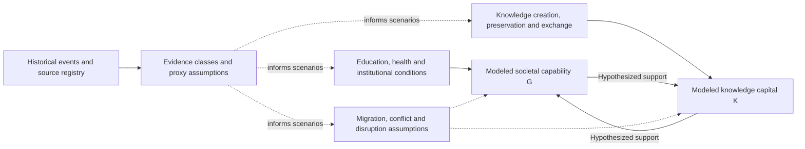

# Iran Knowledge Model | Visual research explanation

**Interpretation first:** This is an *uncalibrated exploratory model of knowledge accumulation and societal conditions*, not a historical IQ dataset, ethnic comparison, intelligence estimate, causal attribution or historical forecast. The original [public showcase](../README.md) distinguishes proxy assumptions from direct observations.

## Conceptual stock-and-driver picture

This is an explanatory schematic based on the **published high-level model description**, not a complete or audited stock-flow representation. K and G are bounded modeled indices, not observed measured national IQ or inherited ability. Scenario traces are conditional outputs from uncalibrated coefficients.

## Publicly supportable evidence

The public README reports the 2,700-year contextual timeline, 20 periods, 55 events, 36 sourced scholar profiles and v0.4 exploratory status; treat these as a version-specific working snapshot. Do not promote the private equations, proxy datasets or unpublished calibration decisions into this public showcase without an explicit release decision.

## Screenshots

No real simulation screenshot is included. A future image should show an expressly approved *synthetic scenario* with visible labels for assumed/proxy inputs and model-generated outputs, without implying historical measurement. Label any explanatory illustration a schematic rather than an application screenshot.

## Suggested GitHub About fields (not applied)

- **Description:** `Exploratory System Dynamics research on knowledge capital and societal capability across historical scenarios.`
- **Topics:** `system-dynamics`, `knowledge-systems`, `historical-modeling`, `simulation`, `research-prototype`
- **Homepage:** leave blank until a safe, verified public demonstration exists.

The private model and source datasets remain private.