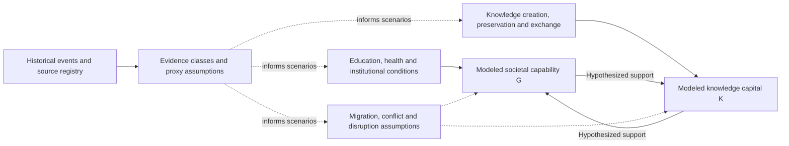

# Iran Knowledge Model | Visual research explanation

**Interpretation first:** This is an *uncalibrated exploratory model of knowledge accumulation and societal conditions*, not a historical IQ dataset, ethnic comparison, intelligence estimate, causal attribution or historical forecast. The original [public showcase](../README.md) distinguishes proxy assumptions from direct observations.

## Conceptual stock-and-driver picture

This is an explanatory schematic based on the **published high-level model description**, not a complete or audited stock-flow representation. K and G are bounded modeled indices, not measured national IQ or inherited ability. Scenario traces are conditional outputs from uncalibrated coefficients.

## How to read a historical model claim

| Layer | Defensible public description | What it cannot establish |
| --- | --- | --- |
| Documentary source | A historical event, scholar record or period has a cited provenance in the working source registry. | A source record alone cannot measure a national cognitive stock. |
| Proxy / classification | Researcher-defined translation of uneven historical evidence into model inputs. | A proxy is not a direct observation or a population-level IQ measurement. |
| Structural assumption | An hypothesized relationship between societal conditions, knowledge capital `K` and modeled capability `G`. | The relationship is not identified causally simply because the model contains an arrow. |
| Scenario input | A conditional choice of event severity or other assumptions. | It is not an independently verified historical counterfactual. |
| Simulation output | A computed path conditional on the chosen structure and coefficients. | It is not an observed historical series, a calibrated forecast or a ranking of peoples. |

**Example caption template (no actual historical estimates):** “Illustrative scenario for modeled indices K and G; assumptions and proxy coding are uncalibrated. Lines are simulated outputs, not observed intelligence measurements.” Any future released figure should carry the specific scenario ID, model revision, units/index definition and input provenance.

## Public research snapshot and release boundary

The [README](../README.md) reports a 2,700-year contextual timeline, 20 modeled periods, 55 events, 36 sourced scholar profiles and v0.4 exploratory status. Those counts are a version-specific catalogue snapshot, not a validated numerical history. Do not copy private equations, unpublished coefficients or source datasets into this public repository without a separate release decision.

## Actual screenshots

No real simulation screenshot has been captured in this change. A later capture must be an approved **synthetic scenario** with visible “modeled / assumption / proxy” labels and a date/version; never represent a smooth modeled curve as measured history. A conceptual illustration must be captioned as a schematic, not as the running application.

## GitHub About fields — proposed, not applied

- **Description:** `Exploratory System Dynamics research on knowledge capital and societal capability across historical scenarios.`
- **Topics:** `system-dynamics`, `knowledge-systems`, `historical-modeling`, `simulation`, `research-prototype`
- **Homepage:** leave blank until a safe, verified public demonstration exists.

The private model and working source datasets remain private.